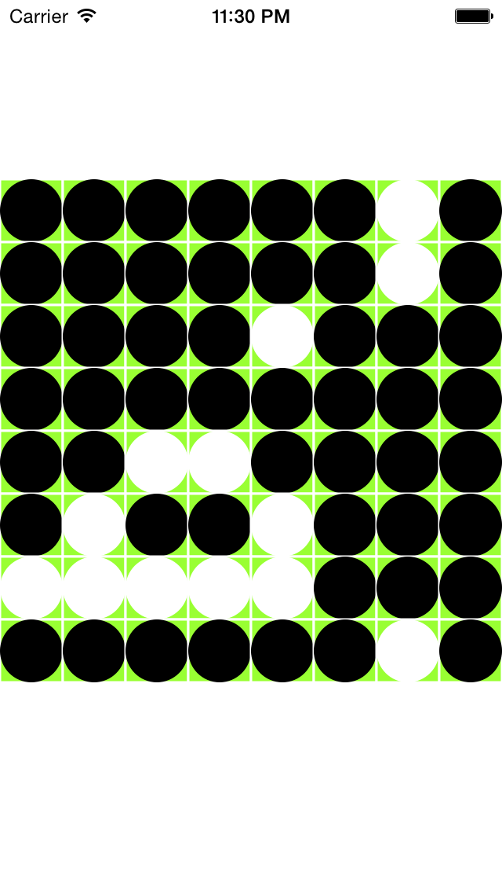

SwiftOthello
============

Appleの新言語Swiftを使って簡単なオセロゲームアプリを作りました。

今回のオセロアプリのポイントは以下のとおりです。

* 一人二役での対戦は寂しいので、一応コンピュータ対戦にする（思考アルゴリズムは無く、単純なランダム)
* 副作用無しで書けそうな部分は、上書きできないlet変数を使って関数型プログラミングを意識してみる

なお、[Newral技術者ブログ](http://newral.info/publics/index/79/&anchor_link=page79_341#page79_341)というサイトでプログラミングの過程を記事にしております。是非ご覧下さい。

###記事へのリンク  
[Swiftでオセロを作る(Part1)](http://newral.info/publics/index/79/page341=4/r_id=192/c_id=341/detail=1/&anchor_link=page79_341_192#page79_341_192)  
[Swiftでオセロを作る(Part2)](http://newral.info/publics/index/79/page341=4/r_id=196/c_id=341/detail=1/&anchor_link=page79_341_196#page79_341_196)  
[Swiftでオセロを作る(Part3)](http://newral.info/publics/index/79/page341=4/r_id=199/c_id=341/detail=1/&anchor_link=page79_341_199#page79_341_199)  
[Swiftでオセロを作る(Part4)](http://newral.info/publics/index/79/page341=3/r_id=200/c_id=341/detail=1/&anchor_link=page79_341_200#page79_341_200)  
[Swiftでオセロを作る(Part5)](http://newral.info/publics/index/79/page341=3/r_id=204/c_id=341/detail=1/&anchor_link=page79_341_204#page79_341_204)  

###ソースコードガイド

SwiftOthello/OthelloView.swift (上記記事でプログラミングしたソースコード)  

###実行方法

Xcode6でコンパイルしてシミューレータまたはiPhoneに入れて実行します。

